# AI Workflow Demo

这是一个用于验证单人 GitHub-native 研发闭环的示例项目。它用 GitHub Issues、Projects、`docs/`、Pull Request、GitHub Actions 和人工审批约定来模拟一个轻量的 AI 辅助研发流程。

## 项目目标

- 用 GitHub Issue 承载任务合同。
- 用 GitHub Project 管理状态、优先级和认领。
- 用 `docs/` 替代核心研发文档库。
- 用 Pull Request 和 GitHub Actions 替代传统 CI / CR / 发布流水线。
- 用 Issue / PR 评论模拟 Human Approval Gateway。

## 示例应用

应用是一个最小任务看板 API，使用 Node.js 内置模块实现，无外部运行时依赖。

功能：

- 创建任务。
- 查询任务列表。
- 修改任务状态：`todo`、`doing`、`done`。
- 使用 JSON 文件持久化任务数据。

## 本地运行

要求 Node.js 20 或更高版本。

```bash
npm test
npm start
```

启动后默认监听：

```text
http://127.0.0.1:3000
```

## API 示例

创建任务：

```bash
curl -X POST http://127.0.0.1:3000/tasks \
  -H 'content-type: application/json' \
  -d '{"title":"写第一个任务","description":"验证 GitHub 工作流"}'
```

查询任务：

```bash
curl http://127.0.0.1:3000/tasks
```

更新状态：

```bash
curl -X PATCH http://127.0.0.1:3000/tasks/<task-id>/status \
  -H 'content-type: application/json' \
  -d '{"status":"done"}'
```

## 工作流

```mermaid
flowchart LR
  Idea["Idea / Bug / Feature"] --> Issue["GitHub Issue<br/>任务合同"]
  Issue --> Project["GitHub Project<br/>状态 / 优先级 / 认领"]
  Project --> Docs["docs/<br/>PRD / Design / ADR"]
  Docs --> Branch["Git Branch"]
  Branch --> PR["Pull Request"]
  PR --> Actions["GitHub Actions<br/>test / AI review"]
  Actions --> Review["人工 Review"]
  Review --> Merge["Merge"]
  Merge --> Release["Release Note"]
  Release --> Done["Issue Done"]
```



## Human Approval Gateway

第一版 Gateway 使用 GitHub 原生能力：

- Issue 或 PR 评论通知人。
- `needs-human-approval` label 表示自动化暂停。
- Project 状态进入 `Waiting Approval`。
- 你回复 `/ai approve`、`/ai revise ...` 或 `/ai reject` 继续流程。

当前已实现的 Gateway 行为：

```text
Issue 评论 /ai approve
→ AI Approval Gateway workflow
→ 生成 docs/design/ISSUE-*.md
→ 创建 ai/issue-* 分支
→ 创建设计 PR
→ 回写 Issue 评论
→ 设计 PR 合并后回写 /ai implement 提示
→ Issue 评论 /ai implement
→ 生成 docs/implementation/ISSUE-*.md、src/generated/* 和 tests/generated/*
→ 创建 ai/implement-issue-* 分支
→ 创建实现 PR
```

安全边界：

- 只有 `OWNER`、`MEMBER`、`COLLABORATOR` 的评论可以触发 approve。
- 默认使用 `GITHUB_TOKEN`。如果希望 AI 创建的分支 / PR 继续触发更多 workflow，可以配置 `AI_WORKFLOW_TOKEN` secret，并授予最小必要权限。
- 当前 Gateway 会创建设计 PR 和实现 PR，但不会自动合并或发布。

### AI 可执行等级

Issue 模板里的 `AI 可执行等级` 是自动化权限合同：

| 等级 | 允许的自动化行为 |
| --- | --- |
| `human-only` | 只能人工处理，`/ai approve` 和 `/ai implement` 会被拒绝。 |
| `assist` | 只允许 AI 输出建议，不允许创建分支或 PR。 |
| `auto-branch` | 允许 AI 创建 `ai/*` 分支并提交产物，但不会自动创建 PR。 |
| `auto-pr` | 允许 AI 创建 `ai/*` 分支、提交产物并创建 PR。 |

当前 Gateway 会在收到命令后读取该等级：

- `human-only` / `assist`：回写 Issue 评论说明未执行原因。
- `auto-branch`：推送分支并回写分支名。
- `auto-pr`：推送分支并创建设计 PR 或实现 PR。

启用 PR 创建能力：

1. 进入仓库 `Settings` → `Actions` → `General`。
2. 在 `Workflow permissions` 中选择 `Read and write permissions`。
3. 勾选 `Allow GitHub Actions to create and approve pull requests`。
4. 保存后重新评论 `/ai approve`，触发最新版本的 `AI Approval Gateway` workflow。

如果不想放开默认 `GITHUB_TOKEN` 的 PR 创建能力，可以创建 `AI_WORKFLOW_TOKEN` secret。该 token 至少需要当前仓库的 `contents: write`、`issues: write` 和 `pull-requests: write` 权限。

## 目录结构

```text
.github/
  ISSUE_TEMPLATE/
  workflows/
docs/
  adr/
  design/
  implementation/
  prd/
  release/
scripts/
src/
tests/
```

## 验证命令

```bash
npm test
```
