# AI Workflow Demo

这是一个用于验证单人 GitHub-native 研发闭环的示例项目。它用 GitHub Issues、Projects、`docs/`、Pull Request、GitHub Actions 和人工审批约定来模拟一个轻量的 AI 辅助研发流程。

## 项目目标

- 用 GitHub Issue 承载任务合同。
- 用 GitHub Project 管理状态、优先级和认领。
- 用 `docs/` 替代核心研发文档库。
- 用 Pull Request 和 GitHub Actions 替代传统 CI / CR / 发布流水线。
- 用 Issue / PR 评论模拟 Human Approval Gateway。

## 示例应用

应用是一个最小任务看板 API，使用 Node.js 内置模块实现，无外部运行时依赖。

功能：

- 创建任务。
- 查询任务列表。
- 修改任务状态：`todo`、`doing`、`done`。
- 使用 JSON 文件持久化任务数据。

## 本地运行

要求 Node.js 20 或更高版本。

```bash
npm test
npm start
```

启动后默认监听：

```text
http://127.0.0.1:3000
```

## API 示例

创建任务：

```bash
curl -X POST http://127.0.0.1:3000/tasks \
  -H 'content-type: application/json' \
  -d '{"title":"写第一个任务","description":"验证 GitHub 工作流"}'
```

查询任务：

```bash
curl http://127.0.0.1:3000/tasks
```

更新状态：

```bash
curl -X PATCH http://127.0.0.1:3000/tasks/<task-id>/status \
  -H 'content-type: application/json' \
  -d '{"status":"done"}'
```

## 工作流

```mermaid
flowchart LR
  Idea["Idea / Bug / Feature"] --> Issue["GitHub Issue<br/>任务合同"]
  Issue --> Project["GitHub Project<br/>状态 / 优先级 / 认领"]
  Project --> Docs["docs/<br/>PRD / Design / ADR"]
  Docs --> Branch["Git Branch"]
  Branch --> PR["Pull Request"]
  PR --> Actions["GitHub Actions<br/>test / AI review"]
  Actions --> Review["人工 Review"]
  Review --> Merge["Merge"]
  Merge --> Release["Release Note"]
  Release --> Done["Issue Done"]
```



## Human Approval Gateway

第一版 Gateway 使用 GitHub 原生能力：

- Issue 或 PR 评论通知人。
- `needs-human-approval` label 表示自动化暂停。
- Project 状态进入 `Waiting Approval`。
- 你回复 `/ai approve`、`/ai revise ...` 或 `/ai reject` 继续流程。

## 目录结构

```text
.github/
  ISSUE_TEMPLATE/
  workflows/
docs/
  adr/
  design/
  prd/
  release/
scripts/
src/
tests/
```

## 验证命令

```bash
npm test
```
